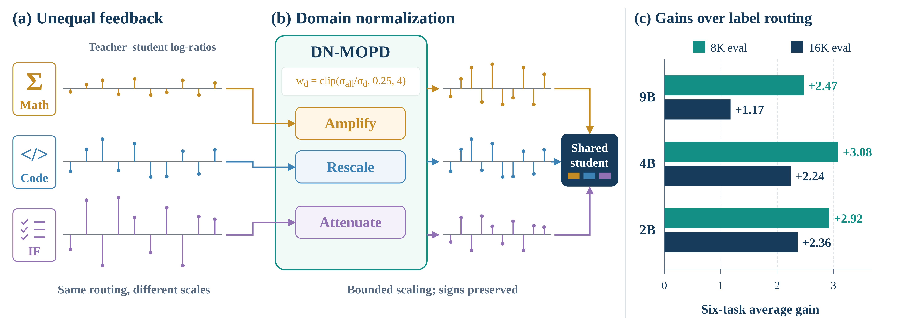

<div align="center">

# DN-MOPD: Domain-Normalized Multi-Teacher On-Policy Distillation

**Label routing decides which teacher supervises a prompt; DN-MOPD also controls how strongly each teacher's
feedback counts.**

[](LICENSE)
[](https://lixin.ai/DN-MOPD)
[](https://arxiv.org/abs/2609.35347)
[](https://huggingface.co/collections/XINLI1997/dn-mopd-6aba5f0df7bd8732d7205ed4)

[Xin Li](https://lixin.ai/)¹, Hao Jiang¹, [Xin Gao](https://gaoxin492.github.io/)², Annan Wang¹, Yuchen Xie¹, Jinghao Guo¹, Xingwei Qu³, Yichi Zhang,
[Chau Yuen](https://blogs.ntu.edu.sg/chau-yuen/)¹

¹ Nanyang Technological University · ² Yale University · ³ University of Manchester

</div>

This repository holds the code, recipes and evaluation records for the paper
*Beyond Teacher Assignment: Domain-Normalized Multi-Teacher On-Policy Distillation*.

<p align="center">
  
</p>

<p align="center"><em>
Label routing decides which teacher supervises a prompt; DN-MOPD also controls how strongly each teacher's feedback
counts. (a) Teacher–student log-ratios differ in scale across domains (schematic). (b) DN-MOPD rescales each domain's
feedback with a bounded, sign-preserving multiplier (schematic). (c) Six-task Total gain of DN-MOPD over label routing.
</em></p>

## The rule

Multi-teacher on-policy distillation (MOPD) routes each prompt of domain *d* to that domain's expert *T_d*. The
student is then trained on the token-level advantage A_t = log p_{T_d}(y_t | h_t) − log π_u(y_t | h_t). DN-MOPD keeps
this routing and adds one operation per batch:

```text
w_d = clip( σ_all / σ_d , 0.25 , 4 )        Ã_t = w_d · A_t
```

Here σ_d is the standard deviation of the teacher–rollout log-ratios over the response tokens of domain *d* in the
batch, and σ_all is the same statistic pooled over all domains. The multiplier is positive, so every advantage keeps
its sign. It needs no extra teacher call, teacher model or learned router, and setting every w_d = 1 recovers MOPD
with label routing ("Label"). The formulas, and where they live in the code, are in [docs/method.md](docs/method.md).

## News

- **2026-10-01**: Model weights released: 21 checkpoints (DN-MOPD and Label students, GRPO teachers, 160-update
  continuations) in the [DN-MOPD collection](https://huggingface.co/collections/XINLI1997/dn-mopd-6aba5f0df7bd8732d7205ed4) on Hugging Face. See [Model weights](#model-weights).
- **2026-09-28**: Paper on arXiv: [arXiv:2609.35347](https://arxiv.org/abs/2609.35347).
- **2026-09-28**: Code, training recipes, training prompt sets and per-question evaluation records released.

## Highlights

- **Teacher assignment alone does not transfer the specialists' skills.** With label routing, MOPD does not beat the
  strongest single-teacher student at any of three Qwen3.5 sizes (9B, 4B, 2B). In the first training batch,
  instruction-following (IF) log-ratios are 2.3–4.4 times as dispersed as the pooled signal, and math log-ratios are
  about half as dispersed. For the initial 4B student, the IF loss supplies 94% of the combined gradient.
- **DN-MOPD improves on MOPD at every size.** The six-task Total rises by +1.17 to +2.36 points at a 16K evaluation
  cap and by +2.47 to +3.08 points at 8K, and every paired 95% interval is above zero. Across three student seeds
  (16K), the mean gains are +1.12 (9B), +1.97 (4B) and +2.34 (2B).
- **Mathematics carries the largest gains.** At 16K, Label shows no math gain over the initial student at any size,
  whereas DN-MOPD improves math at every size. On MATH-500 (16K) it leads Label by +0.74 (9B), +1.25 (4B) and
  +5.95 (2B) points.
- **The gain comes mainly from turning down IF feedback.** Changing the teacher assignment (a uniform pool or a
  dynamic router) brings no consistent gain. In fixed-weight controls at 4B and 2B, lowering only IF's weight to 0.25
  recovers most of DN-MOPD's improvement, while doubling only the math weight recovers about half at 4B and little at
  2B. Weights fixed at DN-MOPD's first-batch multipliers show no detectable difference from DN-MOPD at 9B and 4B;
  at 2B, per-batch estimation is 1.10 points better.
- **Scope.** DN-MOPD is not the best integration recipe overall. SeqKD-SFT and task-arithmetic merging
  (ParamMerge-TA) keep higher Totals under their own training recipes (see the table below). DN-MOPD's gain over the
  strongest single-teacher student is smaller than its gain over Label, and some of those intervals include zero.

## Repository map

```text
DN-MOPD/
├── dn_mopd/          # standalone, framework-agnostic DN-MOPD package (multipliers, scaling, clipped OPD loss)
├── miles/            # cleaned fork of Uni-OPD/miles (FSDP + SGLang) with the DN-MOPD hook
├── patches/          # our changes against upstream Uni-OPD 08fcec0, as a patch, with PATCHES.md
├── recipes/qwen3.5/  # launch scripts and configs for every row of the paper's tables (one 8-GPU node)
├── data/             # prompt-set manifest, download.py (Hugging Face), rebuild scripts from public datasets
├── eval/             # vLLM generation, graders (math-verify, LiveCodeBench, IFEval, IFBench), aggregation, bootstrap
├── reproduce/        # per-question evaluation records (CC BY 4.0) + reproduce.py -> "ALL MATCH"
├── env/              # pinned requirements, constraints, install guide, Dockerfiles, check_env.py
├── hf/               # model cards, card generator and upload tooling for the released weights
├── docs/             # method.md, recipe.md, hardware.md, faq.md
├── tests/            # CPU tests: core/ (dn_mopd, data), trainer/, eval/
└── Makefile          # make check (CPU tests), make reproduce
```

## Installation

Training and evaluation use two separate environments. Training needs Python 3.12, torch 2.11 (CUDA 13.0),
SGLang 0.5.15.post1 and transformers 5.12.1. Evaluation needs Python 3.10, vLLM 0.18.0 and transformers 4.57.6.
All versions are pinned, and [env/install.md](env/install.md) has the full steps, driver requirements and a
Docker option.

```bash
git clone https://github.com/LiXin97/DN-MOPD.git && cd DN-MOPD

# training environment
conda create -y -n dnmopd-train python=3.12 && conda activate dnmopd-train
pip install --index-url https://download.pytorch.org/whl/cu130 torch==2.11.0 torchvision==0.26.0 torchaudio==2.11.0
pip install -r env/requirements-train.txt -c env/constraints-train.txt
pip install --no-deps -e ./miles -e .
python env/check_env.py --env train

# evaluation environment
conda create -y -n dnmopd-eval python=3.10 && conda activate dnmopd-eval
pip install -r env/requirements-eval.txt -c env/constraints-eval.txt
pip install --no-deps -e .
python -m eval.external.fetch         # official LiveCodeBench / IFEval / IFBench checkers + nltk data, pinned
python env/check_env.py --env eval
```

## Quick start

### (a) Use DN-MOPD in your own trainer

The `dn_mopd` package depends only on torch. Give it one domain label and the token log-ratios for each response,
and it returns the multipliers, the scaled advantages and the unchanged clipped OPD loss:

```python
import torch
from dn_mopd import domain_multipliers, scale_advantages, clipped_opd_loss

domains = ["math", "code", "if", "if"]                          # one domain label per response
teacher = [torch.randn(n) for n in (6, 5, 4, 7)]                 # teacher log-probs of the sampled tokens
rollout = [t + s * torch.randn_like(t) for t, s in zip(teacher, (0.1, 0.1, 2.0, 2.0))]  # cached at sampling
actor = [r.clone().requires_grad_() for r in rollout]            # current policy log-probs (with grad)

weights, _ = domain_multipliers(zip(domains, [t - r for t, r in zip(teacher, rollout)]))  # clip(σ_all/σ_d, 0.25, 4)
adv = scale_advantages([t - a.detach() for t, a in zip(teacher, actor)], domains, weights)  # w_d · A_t, detached
loss = clipped_opd_loss(actor, [a.detach() for a in actor], adv, [torch.ones_like(t) for t in teacher])
loss.backward()
print(weights)   # the widely spread IF feedback gets w < 1; math and code get w > 1
```

For padded `(B, T)` tensors, use `DomainNormalizer.multipliers_batched`, `scale_advantages_batched` and
`clipped_opd_loss_batched`. The `DomainNormalizer` class also implements the paper's control modes (observe-only,
fixed and frozen weights). [dn_mopd/README.md](dn_mopd/README.md) documents the API, and
`python -m dn_mopd.examples.toy_opd_loop` runs a CPU toy loop. Compute σ over the **whole rollout batch**. In our
trainer this happens once per batch, in the reward post-processing step. A trainer whose data-parallel ranks each
hold a shard can use `DomainNormalizer(..., sync=True)`, which all-reduces the statistics. See
[docs/method.md](docs/method.md) and the [FAQ](docs/faq.md).

### (b) Reproduce the paper's numbers from the released records (CPU only; needs numpy)

```bash
python reproduce/reproduce.py --no-bootstrap   # scores and point estimates (seconds)
python reproduce/reproduce.py                  # plus the paired bootstrap intervals (a few minutes); prints "ALL MATCH"
```

This recomputes every Qwen3.5 score, paired contrast and interval in the paper from the per-question records, and
checks each value against the paper's tables. [reproduce/README.md](reproduce/README.md) describes the records and
the model keys.

### (c) Evaluate a model

Evaluation uses vLLM with one engine per GPU, the non-thinking chat template, temperature 1.0, top-p 1.0 and a
16,384-token cap (8,192 in the appendix). It covers AIME25/AIME26 (avg@64), LiveCodeBench v5/v6 (avg@6) and
IFEval/IFBench (strict prompt accuracy, avg@16).

```bash
conda activate dnmopd-eval
python -m eval.external.fetch                    # pinned official checkers (once)
python -m eval.data.prepare                      # rebuild and verify the benchmark catalogs from public sources (once)
for s in aime25 aime26 lcb_v5 lcb_v6 ifeval ifbench; do
  python -m eval.generate --model /path/to/hf_model --name my_model --suite $s --max-tokens 16384   # GPU
  python -m eval.grade --gen outputs/eval/my_model/$s/cap16384                                      # CPU
done
python -m eval.aggregate --records outputs/eval --cap 16384                      # suite, domain and Total scores
python -m eval.compare my_model q35_9b_s_route --records-a outputs/eval --cap 16384   # paired bootstrap vs. Label
```

[eval/README.md](eval/README.md) documents the protocol, the pinned benchmark sources and graders, sharding a suite
over several GPUs, and how the package was checked against the paper's own answers. `bash eval/smoke_test.sh` runs
the whole pipeline on a few questions with one GPU.

### (d) Train teachers and students

Every row of the paper's tables has a recipe in [recipes/qwen3.5/](recipes/qwen3.5/). All of them run on a single
node with 8 GPUs. A student uses GPUs 0–3 for the FSDP actor and its colocated SGLang rollout, and GPUs 4–6 for the
three teacher servers. A GRPO teacher uses all 8 GPUs.

```bash
conda activate dnmopd-train
python data/download.py             # the four training prompt sets (about 0.97 GB) from Hugging Face, sha256-checked
export MODEL_ROOT=/path/to/models   # holds Qwen3.5-{2B,4B,9B}; if missing, the base model is downloaded from the Hub
# 1) three GRPO experts per size (math, code, IF); each exports a Hugging Face checkpoint
for d in math code ifeval; do bash recipes/qwen3.5/train_teacher_grpo.sh $d 9b; done
# 2) students on one node: Label (w_d = 1) and DN-MOPD, student seed 42, 80 updates
bash recipes/qwen3.5/train_student.sh label   9b 42
bash recipes/qwen3.5/train_student.sh dn_mopd 9b 42
```

`train_student.sh` also runs every other row and control (`single_math`, `uniform_pool`, `dynamic_router`,
`annealed_injection`, `fixed_w`, `frozen_update0`, `observe`, ...; see `recipes/qwen3.5/configs/methods.yaml`).
Rerunning the same command resumes from the last checkpoint, and a fourth argument of 160
(`train_student.sh dn_mopd 9b 42 160`) continues a run to 160 updates. The code teacher and the students start a
local code-execution judge (`start_code_judge.sh`). It runs model-written programs under resource limits, but it is
not a sandbox, so use a machine you control.

The prompt sets are hosted in the Hugging Face dataset
[XINLI1997/DN-MOPD-Data](https://huggingface.co/datasets/XINLI1997/DN-MOPD-Data), pinned by revision in
`data/MANIFEST.json`; `data/build/build_data.py` rebuilds the same bytes from the public upstream datasets instead
(see [data/README.md](data/README.md)). [docs/recipe.md](docs/recipe.md) lists every hyperparameter and every known
quirk of the original runs.

### (e) Run the CPU checks

```bash
pip install -r env/requirements-dev.txt   # pytest, in each environment that runs tests
make check TRAIN_PYTHON=/path/to/train-env/bin/python EVAL_PYTHON=/path/to/eval-env/bin/python
make reproduce                             # = python reproduce/reproduce.py --no-bootstrap
```

`make check` runs `tests/core` and `tests/trainer` with the training environment and `tests/eval` with the evaluation
environment, all on CPU. Tests that need the downloaded prompt sets, the fetched checkers or the prepared benchmark
data skip with a message that says what to run.

## Results

Capability integration at 9B: Qwen3.5-9B scores (%) on six public tasks at a 16K evaluation cap, with student seed
42. Math is avg@64, code avg@6 and IF avg@16. Total averages the six task scores. Bold marks the best result within
the multi-teacher OPD block. The 4B and 2B results, the 8K results and all intervals are in the paper and in
`reproduce/`.

| Group | Method | AIME25 | AIME26 | LCB v5 | LCB v6 | IFEval | IFBench | Total |
|---|---|:---:|:---:|:---:|:---:|:---:|:---:|:---:|
|  | Initial student | 57.7 | 62.6 | 54.9 | 51.4 | 82.4 | 33.8 | 57.1 |
| RL experts | Math expert | 59.7 | 69.4 | 53.4 | 49.4 | 82.3 | 34.9 | 58.2 |
|  | Code expert | 58.5 | 65.4 | 58.5 | 54.3 | 82.3 | 34.6 | 58.9 |
|  | IF expert | 54.6 | 60.5 | 54.0 | 51.5 | 86.5 | 42.1 | 58.2 |
| Offline distillation | SeqKD-SFT | 61.3 | 67.6 | 62.7 | 56.0 | 86.0 | 42.4 | 62.6 |
| Parameter merging | ParamMerge-Avg | 59.4 | 68.3 | 54.0 | 50.9 | 84.1 | 36.4 | 58.9 |
|  | ParamMerge-TA | 59.1 | 68.6 | 55.2 | 50.9 | 86.1 | 43.3 | 60.5 |
| Single-teacher OPD | Math teacher | 58.9 | 69.5 | 53.7 | 49.4 | 82.4 | 34.7 | 58.1 |
|  | Code teacher | 58.3 | 66.2 | 57.0 | 52.6 | 82.6 | 34.2 | 58.5 |
|  | IF teacher | 56.8 | 61.9 | 52.1 | 49.2 | 84.7 | 38.9 | 57.3 |
| Multi-teacher OPD | Uniform pool | 57.1 | 65.9 | 53.6 | 52.3 | 83.3 | 35.7 | 58.0 |
|  | Dynamic router | 56.4 | 63.5 | 55.4 | 51.5 | 84.3 | 37.7 | 58.1 |
|  | Label-routed MOPD | 55.3 | 63.2 | **56.8** | **52.6** | 84.0 | 38.4 | 58.4 |
|  | **DN-MOPD (Ours)** | **58.9** | **67.7** | 56.3 | 51.4 | **84.5** | **38.7** | **59.6** |

Six-task Total gain of DN-MOPD over Label, student seed 42, with paired 95% bootstrap intervals:

| Size | 16K cap | 8K cap |
|---|:---:|:---:|
| 9B | +1.17 [+0.28, +2.03] | +2.47 [+1.65, +3.27] |
| 4B | +2.24 [+1.30, +3.20] | +3.08 [+2.12, +4.06] |
| 2B | +2.36 [+1.58, +3.17] | +2.92 [+2.02, +3.85] |

## Model weights

All 21 checkpoints are on Hugging Face under `XINLI1997/DN-MOPD-Qwen3.5-<size>[-<suffix>]` and grouped in the
[DN-MOPD collection](https://huggingface.co/collections/XINLI1997/dn-mopd-6aba5f0df7bd8732d7205ed4). They are the exact exports that produced the paper's scores.

| Model | 9B | 4B | 2B |
|---|:---:|:---:|:---:|
| DN-MOPD student, 80 updates (Tables 1–2) | [9B](https://huggingface.co/XINLI1997/DN-MOPD-Qwen3.5-9B) | [4B](https://huggingface.co/XINLI1997/DN-MOPD-Qwen3.5-4B) | [2B](https://huggingface.co/XINLI1997/DN-MOPD-Qwen3.5-2B) |
| Label baseline (label-routed MOPD), 80 updates | [9B](https://huggingface.co/XINLI1997/DN-MOPD-Qwen3.5-9B-baseline-label) | [4B](https://huggingface.co/XINLI1997/DN-MOPD-Qwen3.5-4B-baseline-label) | [2B](https://huggingface.co/XINLI1997/DN-MOPD-Qwen3.5-2B-baseline-label) |
| Math expert (GRPO teacher) | [9B](https://huggingface.co/XINLI1997/DN-MOPD-Qwen3.5-9B-teacher-math) | [4B](https://huggingface.co/XINLI1997/DN-MOPD-Qwen3.5-4B-teacher-math) | [2B](https://huggingface.co/XINLI1997/DN-MOPD-Qwen3.5-2B-teacher-math) |
| Code expert (GRPO teacher) | [9B](https://huggingface.co/XINLI1997/DN-MOPD-Qwen3.5-9B-teacher-code) | [4B](https://huggingface.co/XINLI1997/DN-MOPD-Qwen3.5-4B-teacher-code) | [2B](https://huggingface.co/XINLI1997/DN-MOPD-Qwen3.5-2B-teacher-code) |
| IF expert (GRPO teacher) | [9B](https://huggingface.co/XINLI1997/DN-MOPD-Qwen3.5-9B-teacher-if) | [4B](https://huggingface.co/XINLI1997/DN-MOPD-Qwen3.5-4B-teacher-if) | [2B](https://huggingface.co/XINLI1997/DN-MOPD-Qwen3.5-2B-teacher-if) |
| DN-MOPD, 160 updates (Table 5) | [9B](https://huggingface.co/XINLI1997/DN-MOPD-Qwen3.5-9B-160updates) | [4B](https://huggingface.co/XINLI1997/DN-MOPD-Qwen3.5-4B-160updates) | [2B](https://huggingface.co/XINLI1997/DN-MOPD-Qwen3.5-2B-160updates) |
| Label, 160 updates (Table 5) | [9B](https://huggingface.co/XINLI1997/DN-MOPD-Qwen3.5-9B-baseline-label-160updates) | [4B](https://huggingface.co/XINLI1997/DN-MOPD-Qwen3.5-4B-baseline-label-160updates) | [2B](https://huggingface.co/XINLI1997/DN-MOPD-Qwen3.5-2B-baseline-label-160updates) |

- Weights are bfloat16 Hugging Face exports (`Qwen3_5ForConditionalGeneration`). The tokenizer, chat template and
  `config.json` are the base model's.
- Use the **non-thinking** chat format (`enable_thinking=False`). The paper evaluated at temperature 1.0 and
  top-p 1.0. Each model card has vLLM and Transformers examples, the model's paper scores and its training recipe.
- The exports omit the base model's 15 `mtp.*` tensors, so MTP speculative decoding is unavailable. Ordinary
  decoding is unaffected.
- Only the seed-42 students are released. [hf/MANIFEST.md](hf/MANIFEST.md) ties every checkpoint to its evaluation
  records in `reproduce/`.

## Citation

```bibtex
@article{li2026dnmopd,
  title   = {Beyond Teacher Assignment: Domain-Normalized Multi-Teacher On-Policy Distillation},
  author  = {Li, Xin and Jiang, Hao and Gao, Xin and Wang, Annan and Xie, Yuchen and Guo, Jinghao and Qu, Xingwei and Zhang, Yichi and Yuen, Chau},
  journal = {arXiv preprint arXiv:2609.35347},
  year    = {2026},
  url     = {https://arxiv.org/abs/2609.35347}
}
```

## License

- **Code:** [Apache License 2.0](LICENSE). The trainer in `miles/` is a modified fork of Uni-OPD / miles
  (Apache-2.0). Attributions are in [NOTICE](NOTICE), and our changes are in [patches/](patches/).
- **Evaluation records** in `reproduce/`: CC BY 4.0.
- **Third-party benchmark and dataset content** keeps its original license; see
  [data/DATA_LICENSES.md](data/DATA_LICENSES.md) for the training prompts and
  [reproduce/THIRD_PARTY.md](reproduce/THIRD_PARTY.md) for the benchmarks.
- **Model weights** are fine-tunes of Qwen3.5 (Apache-2.0) and carry the same license; each repository includes
  the base model's `LICENSE`.

## Acknowledgements

This work builds on many open-source projects:

- **[Uni-OPD](https://github.com/WenjinHou/Uni-OPD)**: the on-policy distillation framework our trainer is forked from.
- **[miles](https://github.com/radixark/miles)**: the RL training framework inside it.
- **[SGLang](https://github.com/sgl-project/sglang)**: rollout and teacher serving.
- **[vLLM](https://github.com/vllm-project/vllm)**: evaluation.
- **[Math-Verify](https://github.com/huggingface/Math-Verify)**: math grading.
- **[LiveCodeBench](https://github.com/LiveCodeBench/LiveCodeBench)**,
  **[IFEval](https://github.com/google-research/google-research/tree/master/instruction_following_eval)** and
  **[IFBench](https://github.com/allenai/IFBench)**: benchmarks and official checkers.
- **[DeepMath-103K](https://huggingface.co/datasets/zwhe99/DeepMath-103K)** and
  **[Eurus-2-RL-Data](https://huggingface.co/datasets/PRIME-RL/Eurus-2-RL-Data)**: training prompts.
- The **Qwen3.5** models, which all our experiments start from.
